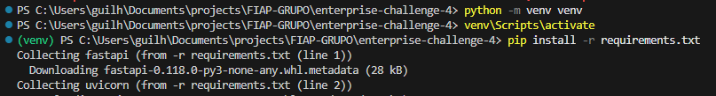

<p align="center">
<a href="https://www.fiap.com.br/">

</a>
</p>


# Hermes Reply – Entrega 4 (MVP Integrado)
1. Coleta/ingestão de dados do ESP32/simulação (Wokwi/VSCode/PlatformIO);
2. Persistência no banco relacional modelado;
3. Treino e/ou inferência do modelo de ML básico;
4. Dashboard/relatório com KPIs e alertas (thresholds ou regra simples).


## 👨‍🎓 Integrantes
- Felipe Balthazar de Almeida
  - #RM562434
- Fernando Gomes da Silva
  - #RM561534
- Guilherme Urbinatti
  - #RM565203
- Vinicius Burchert Vilas Boas
  - #RM565395


## 🗂️ Estrutura de Pastas

```
src/
├── sistema/
├── simulador/
├── assets/
└── 
```

---

## 🔧 Como Executar
### SISTEMA (Python)

### Alterar
```
...\config\config.json
{
    "ORACLE_USER": "RM001122",
    "ORACLE_PASSWORD": "------",
    "ORACLE_DSN": "oracle.fiap.com.br:1521/ORCL"
}
```

```
Windows
 > python -m venv venv
 > venv\Scripts\activate
 > cd sistema
 > pip install -r requirements.txt
 > python start.py
```


### Sistema Python e Modelo ML: http://localhost:8000/docs
### DashBoard Streamlit: http://localhost:8501/