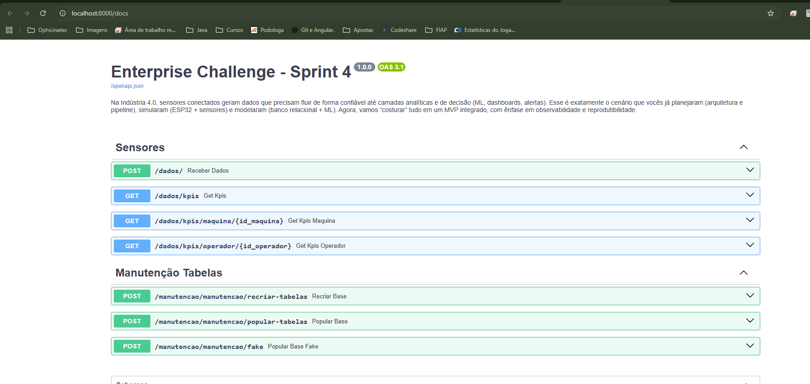
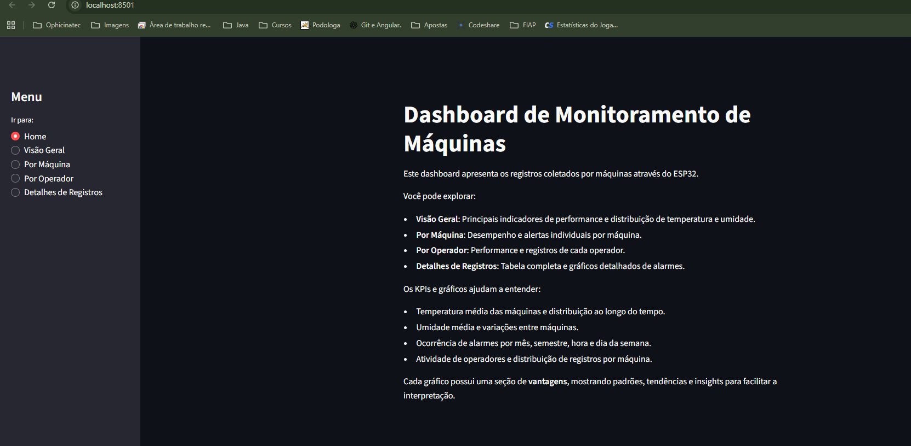
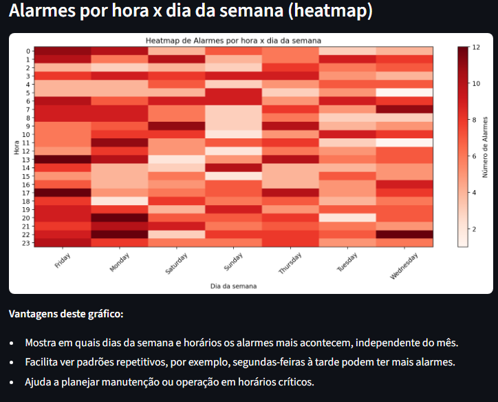
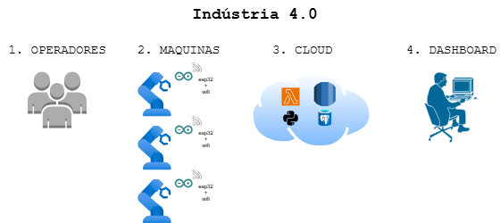

<p align="center">
<a href="https://www.fiap.com.br/">

</a>
</p>


# Hermes Reply – Entrega 4 (MVP Integrado)
1. Coleta/ingestão de dados do ESP32/simulação (Wokwi/VSCode/PlatformIO);
2. Persistência no banco relacional modelado;
3. Treino e/ou inferência do modelo de ML básico;
4. Dashboard/relatório com KPIs e alertas (thresholds ou regra simples).


## 👨‍🎓 Integrantes
- Felipe Balthazar de Almeida
  - #RM562434
- Fernando Gomes da Silva
  - #RM561534
- Guilherme Urbinatti
  - #RM565203
- Vinicius Burchert Vilas Boas
  - #RM565395


## 🗂️ Estrutura de Pastas

```
📁/
├──📄README.md
|
├──📁assets/      
|
├──📁esp32/
│   ├──📄README.md
│   ├──diagram.json    → Formato JSON, que renderiza o Wokwi.
│   ├──libraries.txt   → Bibliotecas utilizadas no projeto.
│   ├──📁src/
│   ├──   ├──main.ino  → Codigo C++ da placa ESP32.
|
├──📁sistema/
|   ├──📁config/       → informacoes de login e senha do BD
|
|   ├──📁dashboard/    →  📊 streamlit e seus graficos
|
|   ├──📁models        →  ml
|
|   ├──📁prediction    →  ml
|
|   ├──📁repository    → consultas oracle 
|
|   ├──📁routers       → rotas da api
|
|   ├──📁scripts       → scripts do banco (criar tabela, inserir, dropar)
|
|   ├──📁services      → regras para alimentar a base de dados / gerar mock
|
|   ├──main.py          → toda parte de python > 🖥️uvicorn
|   ├──requeriments.txt → dependencias do projeto
|   ├──start.py         → inicia o 🖥️uvicorn e 📊streamlit 

```

---

## 🔧 Como Executar
### SISTEMA (Python)

### Alterar
```
...\config\config.json
{
    "ORACLE_USER": "RM001122",
    "ORACLE_PASSWORD": "------",
    "ORACLE_DSN": "oracle.fiap.com.br:1521/ORCL"
}
```

```
Windows
 > python -m venv venv
 > venv\Scripts\activate
 > cd sistema
 > pip install -r requirements.txt
 > python start.py
```


### Sistema Python e Modelo ML: http://localhost:8000/docs


### DashBoard Streamlit: http://localhost:8501/


- Exemplo de grafico



### Diagrama


1. OPERADORES
   - Responsáveis pelo manuseio das máquinas.
   - Acionam, monitoram e mantêm o equipamento.
2. MÁQUINAS
   - Cada máquina possui um `ESP32`, conectado à rede para comunicação com a `Cloud`.
   - O `ESP32` monitora sensores de **temperatura**, **umidade**, **gases** e **alarmes**, detectando anomalias em tempo real.
3. CLOUD
   - Recebe dados do `ESP32` via `HTTP`.
   - AWS Lambda (`Python`) processa os dados: Valida e transforma os registros.
   - Persiste as informações no `RDS PostgreSQL`.
   - Garante armazenamento centralizado e seguro.
4. DASHBOARD
   - Desenvolvido em `Streamlit` (`Python`).
   - Fornece alertas e relatórios processados na `Cloud`.
   - Acesso para gestores da indústria, permitindo tomada de decisão rápida.
